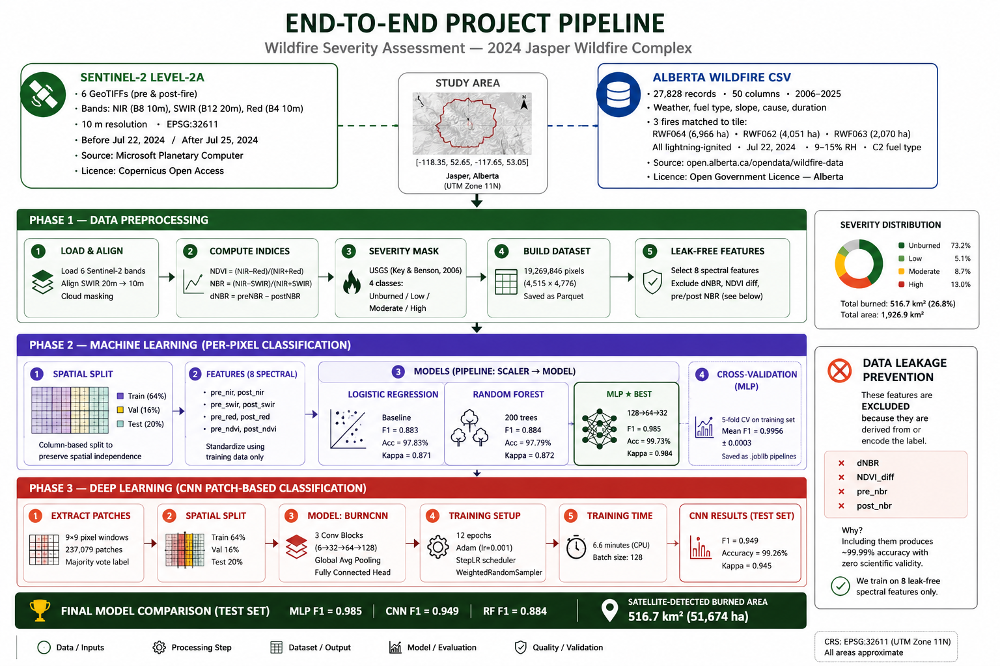
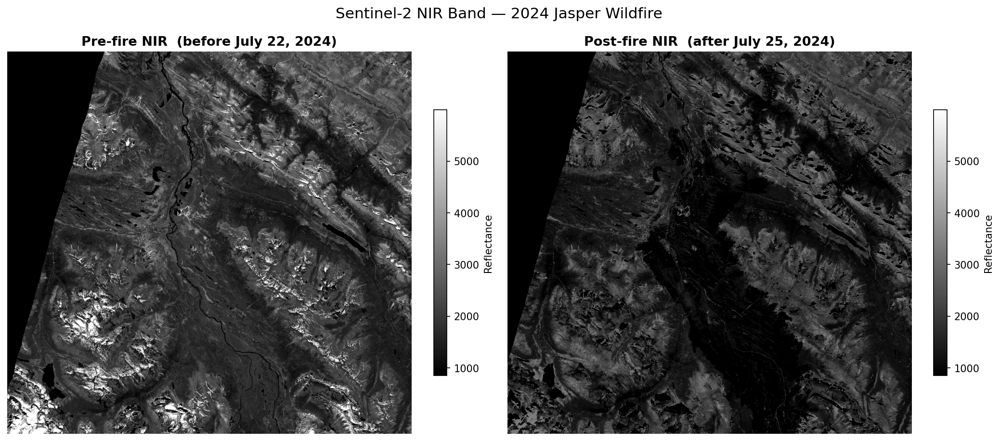

# 🔥 Wildfire Severity Assessment — 2024 Jasper, Alberta

> Burned area detection and severity mapping of the 2024 Jasper Wildfire Complex using Sentinel-2 satellite imagery, machine learning, and deep learning.
> **University of Calgary · DATA 607 · March 2026**

[](https://python.org)
[](https://open.alberta.ca/licence)

---

## 📋 Overview

The 2024 Jasper Wildfire Complex is the largest fire in Jasper National Park in over a century, burning approximately **35,000 hectares** of Alberta boreal and subalpine forest and destroying nearly half of the town of Jasper.

This project maps burned area extent and severity using two publicly available datasets — Sentinel-2 multispectral satellite imagery and the Government of Alberta Historical Wildfire Dataset — and compares four machine learning and deep learning methods under a rigorous, leak-free, spatially honest experimental design.

**Satellite-derived burned area: 516.7 km² (51,674 ha)**

---



## 🏆 Results

| Model | Accuracy | F1 Score | Cohen's Kappa |
|---|---|---|---|
| **MLP Neural Network** ⭐ | 99.73% | **0.985** | 0.984 |
| CNN (BurnCNN 9×9 patches) | 99.26% | 0.949 | 0.945 |
| Random Forest | 97.79% | 0.884 | 0.872 |
| Logistic Regression (baseline) | 97.83% | 0.883 | 0.871 |

> MLP 5-fold CV (train set): **Mean F1 = 0.9956 ± 0.0003** — stable, no overfitting

---

## 📁 Repository Structure

```
Wildfire-Severity-Assessment-in-Alberta/
│
├── burned_area_download.ipynb          # Sentinel-2 acquisition via STAC API
├── impact_assessment.ipynb             # Full pipeline — Phase 1, 2, 3
├── requirements.txt
├── .gitignore
│
└── alberta_burned_area_project/
    └── data/
        └── processed/
            ├── fire_metadata_jasper.csv       # 67 fire records (encoded)
            ├── phase2_LR_baseline.joblib      # Fitted LR pipeline
            ├── phase2_RF_spectral.joblib      # Fitted RF pipeline
            ├── phase2_MLP_spectral.joblib     # Fitted MLP pipeline
            ├── 03_dnbr_severity_map.png       # Burn severity map
            ├── 04_severity_distribution.png   # Severity class breakdown
            ├── 07_correlation_heatmap.png     # Feature correlations
            ├── 11_model_comparison.png        # Model comparison chart
            └── 12_confusion_matrices.png      # Confusion matrices
```

> **Not tracked (too large for Git):** Raw GeoTIFF files, .npy arrays, .parquet pixel datasets. All fully reproducible from the notebooks.

---

## 🛰️ Datasets

### Dataset 1 — Sentinel-2 Level-2A (ESA / Microsoft Planetary Computer)
- 6 GeoTIFF files — pre-fire and post-fire NIR (B8), SWIR (B12), Red (B4)
- Resolution: 10 m · CRS: EPSG:32611 · Bounding box: [-118.35, 52.65, -117.65, 53.05]
- Pre-fire: before July 22, 2024 · Post-fire: after July 25, 2024
- Licence: [Copernicus Open Access Policy](https://spacedata.copernicus.eu)



### Dataset 2 — Alberta Historical Wildfire Dataset
- 27,828 records · 50 columns · 2006–2025
- Three fires matched to satellite tile: **RWF064** (6,966 ha) · **RWF062** (4,051 ha) · **RWF063** (2,070 ha)
- All lightning-ignited July 22, 2024 · 9–15% RH · C2 conifer fuel type
- Source: https://open.alberta.ca/opendata/wildfire-data
- Licence: [Open Government Licence — Alberta](https://open.alberta.ca/licence)

---

## ⚙️ Methodology

### Phase 1 — Data Preprocessing
- Load and align 6 Sentinel-2 bands (SWIR upsampled 20 m → 10 m)
- Compute spectral indices: NDVI, NBR, dNBR
- Apply USGS burn severity thresholds (Key & Benson, 2006)
- Build pixel dataset (19,269,846 rows) saved as Parquet
- Apply leak-free feature filter → 8 clean spectral features

| Class | Area | % of valid pixels |
|---|---|---|
| Unburned | 1,410.2 km² | 73.2% |
| Low severity | 99.0 km² | 5.1% |
| Moderate severity | 168.0 km² | 8.7% |
| High severity | 249.8 km² | 13.0% |
| **Total burned** | **516.7 km²** | **26.8%** |

### Phase 2 — Machine Learning (per-pixel)
- **Split:** Spatial column split (64% train / 16% val / 20% test) — no test pixel is adjacent to a training pixel
- **Features:** 8 leak-free spectral features (raw bands + pre/post NDVI)
- **Pipeline:** StandardScaler → model, fitted on training data only
- **Models:** Logistic Regression · Random Forest (200 trees) · MLP (128→64→32)

### Phase 3 — Deep Learning (CNN)
- **Patches:** 9×9 pixel windows · 237,079 total patches · majority vote label
- **Architecture:** BurnCNN — 3 conv blocks (6→32→64→128) + Global Average Pooling + FC head with Dropout(0.4)
- **Training:** 12 epochs · Adam lr=0.001 · StepLR · WeightedRandomSampler · 6.6 min CPU

---

## 🚫 Data Leakage — Critical Design Decision

| Feature | Reason excluded |
|---|---|
| dnbr | IS the label threshold — burned = dNBR ≥ 0.10 by definition |
| ndvi_diff | Directly encodes label direction (pre minus post NDVI) |
| pre_nbr, post_nbr | Conservative removal — mathematically close to dNBR |

Including dNBR produces ~99.99% accuracy with zero scientific validity. All reported metrics reflect models trained on raw spectral reflectance only.

---

## 💻 Setup

```bash
git clone https://github.com/cnero101/Wildfire-Severity-Assessment-in-Alberta.git
cd Wildfire-Severity-Assessment-in-Alberta
python -m venv .venv
.venv\Scripts\activate
pip install -r requirements.txt
```

---

## 🔁 Reproducing the Analysis

```
1. burned_area_download.ipynb   →  downloads Sentinel-2 GeoTIFFs via STAC API
2. impact_assessment.ipynb      →  runs Phase 1, 2, and 3 end-to-end
```

All outputs are saved to alberta_burned_area_project/data/processed/ and reloaded automatically in subsequent steps.

---

## 📊 Key Findings

- Satellite detects **516.7 km²** vs 13,087 ha in provincial records — difference explained by Jasper National Park falling outside the provincial reporting system (federal jurisdiction)
- **MLP** is the best per-pixel classifier (F1 = 0.985) — captures non-linear spectral relationships that LR and RF cannot
- **LR and RF perform nearly identically** (F1 ≈ 0.883) — decision boundary is approximately linear for both
- **CNN achieves F1 = 0.949** at patch level with spatially smoother predictions
- **Tabular CSV features** add no discriminating power at pixel level — spatially explicit raster weather data would be needed for meaningful fusion

---

## 📚 References

- Key, C. H., & Benson, N. C. (2006). Landscape assessment: Sampling and analysis methods. USDA Forest Service GTR RMRS-GTR-164-CD.
- Knopp, L., Wieland, M., Rättich, M., & Martinis, S. (2020). A deep learning approach for burned area segmentation with Sentinel-2 data. Remote Sensing, 12(15), 2422.
- Zhang, P., Hu, X., Ban, Y., Nascetti, A., & Gong, M. (2024). Assessing Sentinel-2 data for large-scale wildfire-burned area mapping. Remote Sensing, 16(3), 556.
- Government of Alberta. (2025). Historical wildfire data 2006-2025. https://open.alberta.ca/opendata/wildfire-data
- Parks Canada. (2025). Wildfire status — Jasper National Park. https://parks.canada.ca/pn-np/ab/jasper/visit/feu-alert-fire

---

## 👥 Team

Paul Moynihan | Ifeanyi Njoku | Anmol Sharma — University of Calgary · DATA 607 · March 2026

---

## 📄 Licence

- Sentinel-2: [Copernicus Open Access](https://spacedata.copernicus.eu)
- Alberta Wildfire CSV: [Open Government Licence — Alberta](https://open.alberta.ca/licence)
- Code: MIT
"@ | Out-File -FilePath "README.md" -Encoding utf8
